# 📱 React Native Firebase Todo App

This is a complete **React Native Todo App** along with **Firebase**. It includes user authentication, Firestore-based task management, scheduled notifications using Notifee, editable user profile details, and an advanced navigation setup using Drawer, Bottom Tab, and Material Top Tabs.

---

## 🚀 Features

### 🔐 Authentication
- **Email & Password Login/Signup** using **Firebase Authentication**.
- Includes **validation** handled from frontend and helpful error messages.

### Screenshots

#### Login Page  
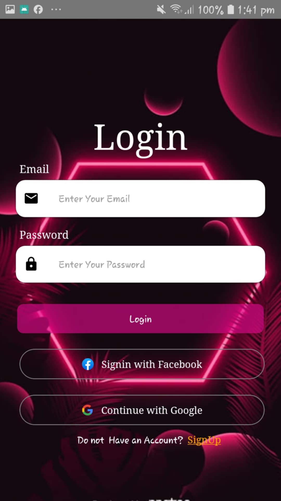  
*Login screen with email and password fields.*

#### Sign Up Page  
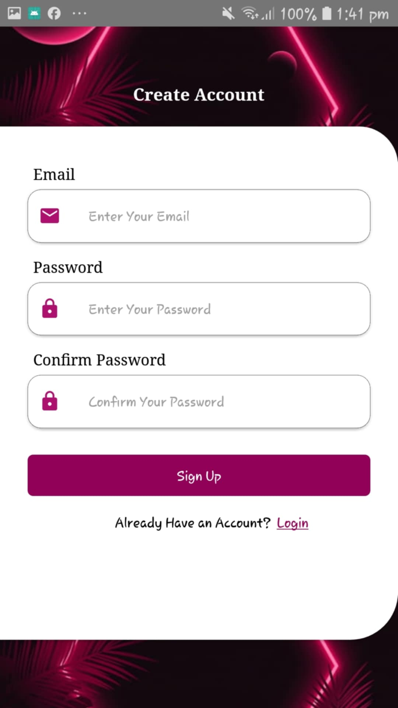  
*User registration page with validation and error handling.*

#### Validations  
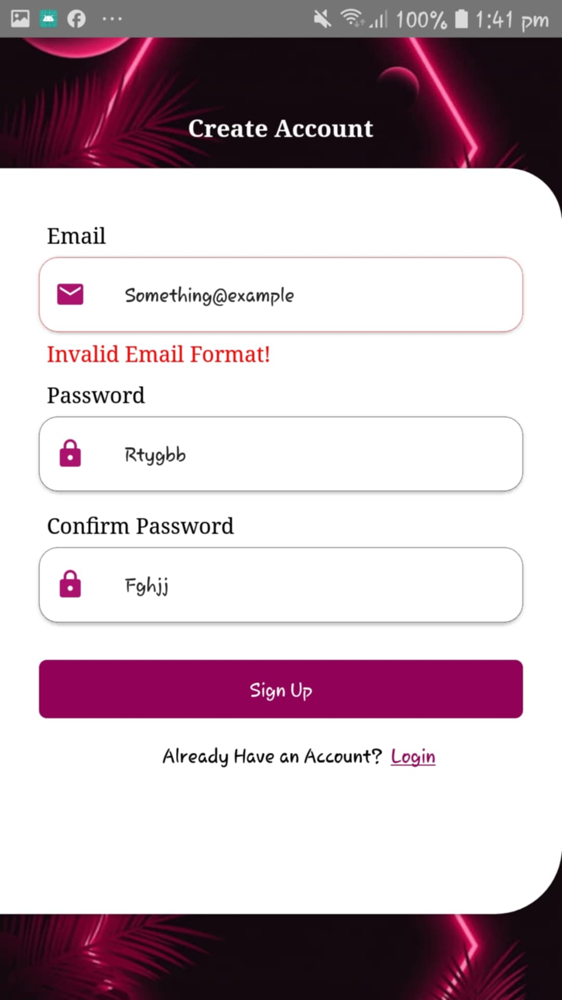  
*Validation error message example 1.*

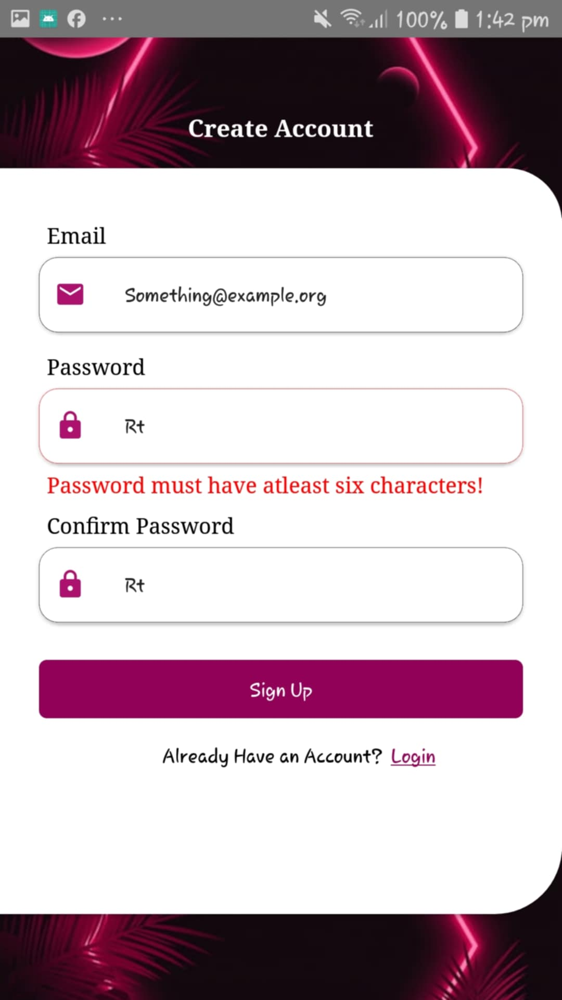  
*Validation error message example 2.*

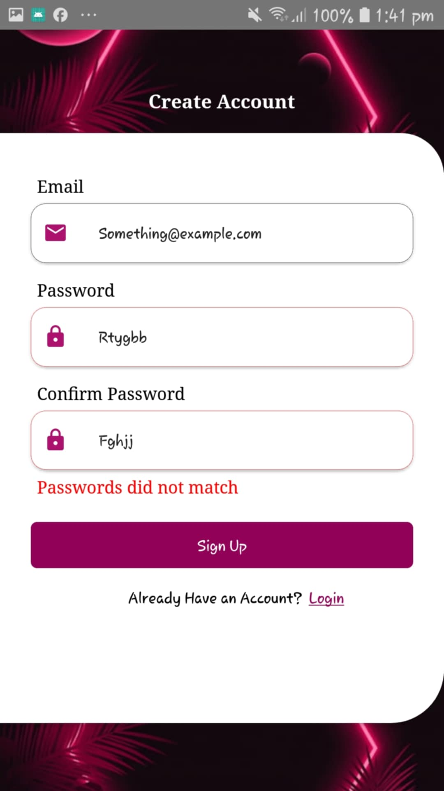  
*Validation error message example 3.*

---

### ✅ Todo Functionality
- Add, update, complete, and delete todos.
- Todos are stored in **Firebase Firestore** and are user-specific.
- Uses Firestore’s **real-time updates** with `onSnapshot`.

#### Home Screen  
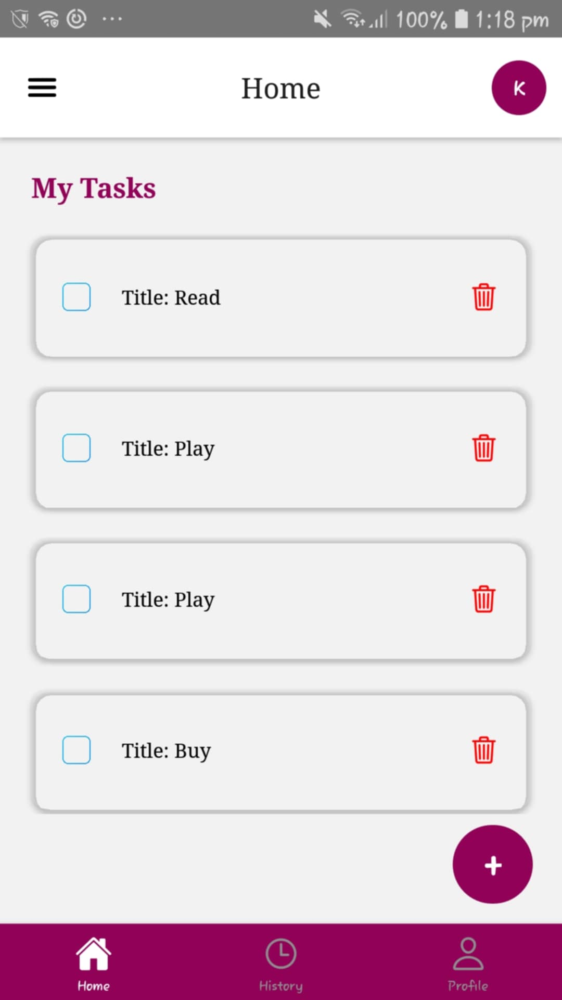  
*Main todo list with filtering and real-time updates.*

#### History Screen  
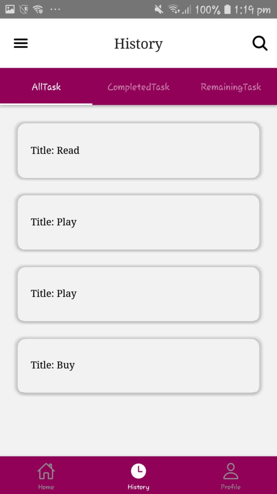  
*View of completed and past todos.*

#### Profile Screen  
  
*User profile showing nickname and phone number.*

#### AddTask Screen  
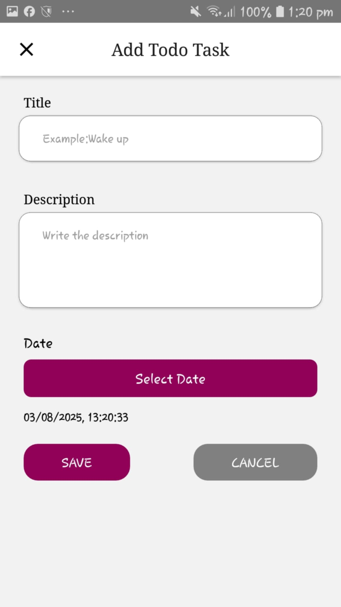  
*Screen to add a new todo with title, description, and date.*

#### Editable TaskDetails Screen  
| 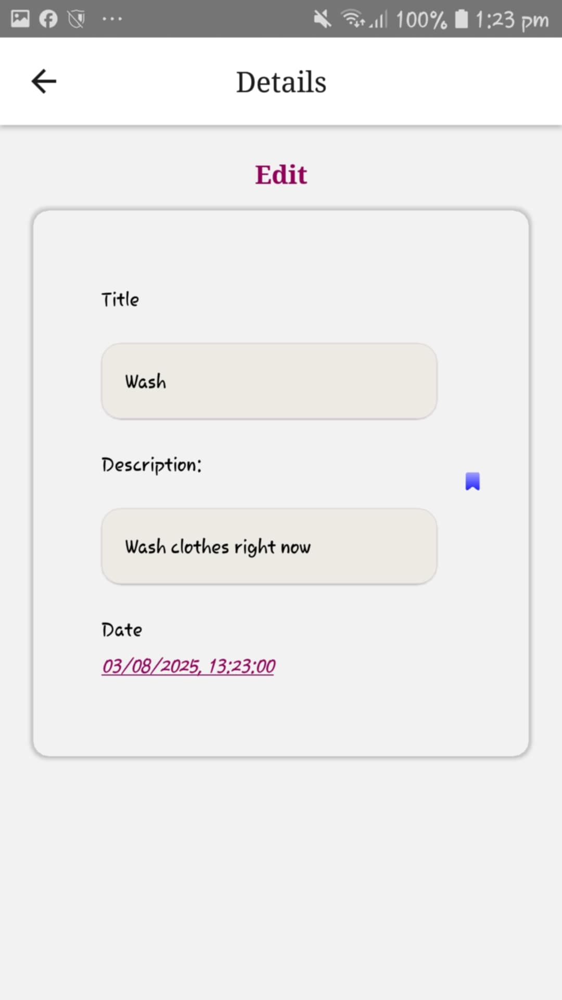 | 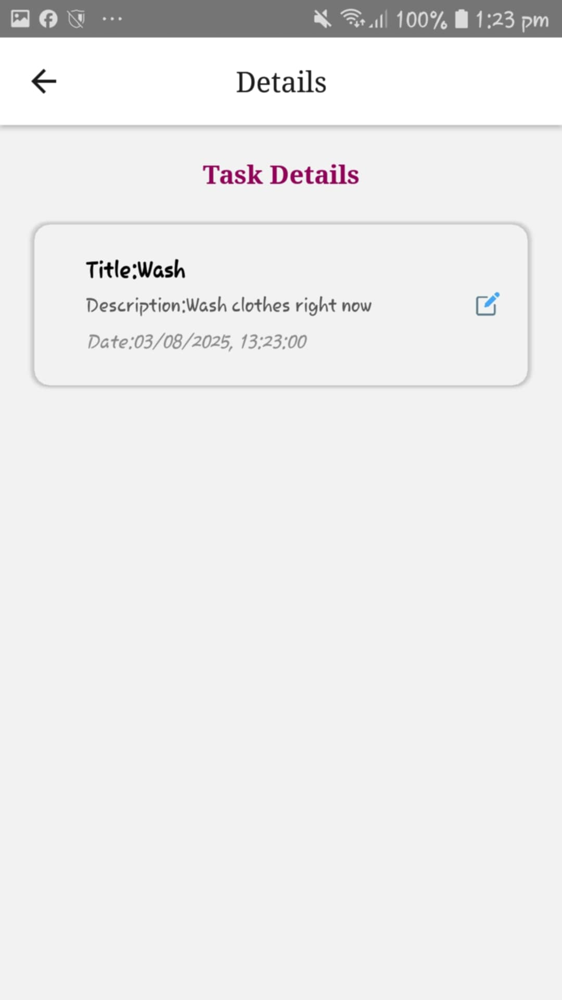 |  
|:---------------------------------------------------------:|:---------------------------------------------------------:|  
*Edit existing todo details and save changes.*

---

### 🔔 Notifications
- Integrated **Notifee** to schedule **local notifications** if time has not passed.
- Cancels notification in case of task deletion or completion.
- Each todo notification includes:
  - Title
  - Description
  - todoId (used to navigate directly to detail)
- Tap notification → navigates to that todo’s detail screen.

#### Notifee Notification on Time  
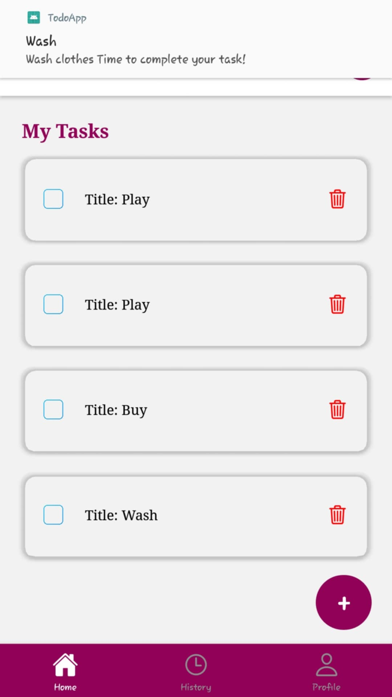  
*Local notification triggered at scheduled todo time.*

#### Rescheduling Notification  
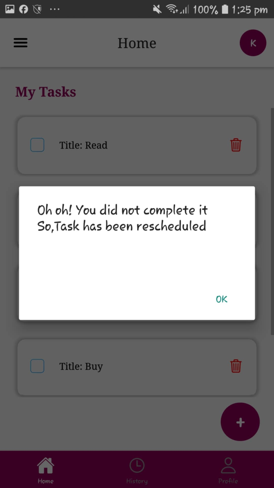  
*Notification rescheduling after task edit.*

#### Navigating to Scheduled Todo  
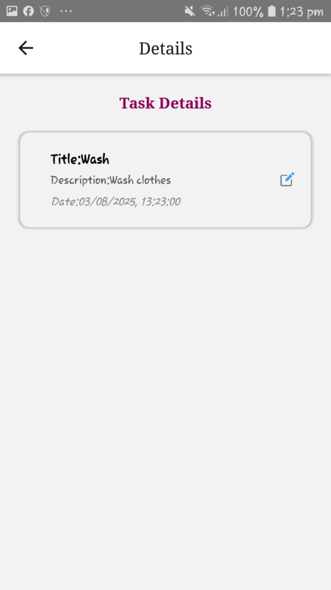  
*Navigation to todo details from notification tap.*

---

### 🔔 Toast Notifications
- Toast notifications provide quick feedback on user actions.

#### Task Completion Toast  
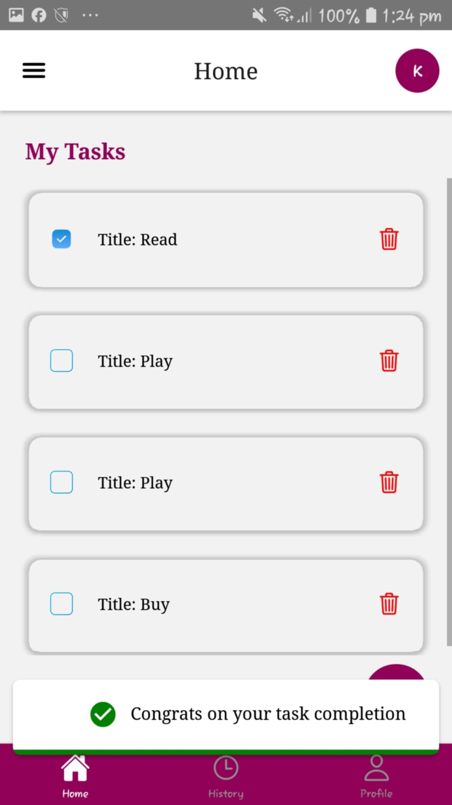  
*Toast shown when a task is marked complete.*

#### Information Toast  
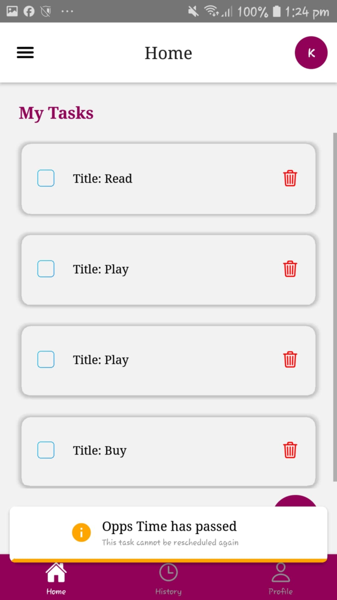  
*General informational toast for various user actions.*

---

### 🧑‍💼 User Profile
- Editable user profile details (nickname & phone number).
- Data updates reflected in both **Firebase Auth** and **Firestore**.

#### Edit Profile Details Screen  
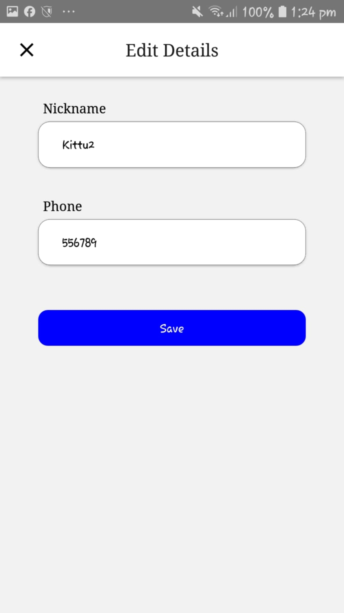  
*Edit nickname and phone number.*

#### Profile Details Edited Screenshot  
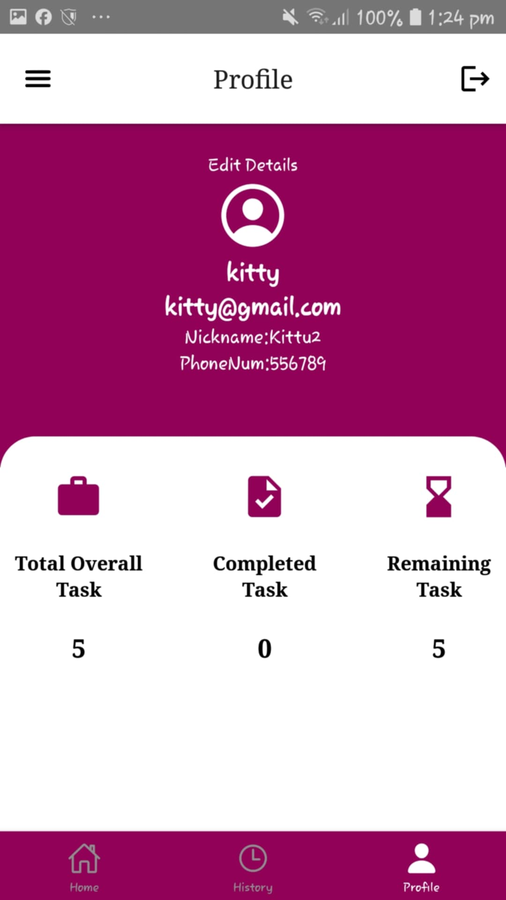  
*Updated profile details saved and displayed.*

---

### 🧭 Advanced Navigation
- 🧾 **Drawer Navigation** – for global app access.
- 📌 **Bottom Tab Navigation** – for switching between main screens.
- 🧭 **Material Top Tab Navigation** – used for filtering tasks (All, Completed, Pending).

---

### 🔄 State Management
- Initially built with **Redux**, later replaced by **Firestore listeners** for real-time UI updates and simplified state logic.

---

## ⚙️ Setup & Run

1. Clone the repo  
2. Run `yarn install` or `npm install`  
3. Setup your Firebase config and `.env` file  
4. Run on your device/emulator: `yarn android` or `yarn ios`  

---

## 🛠 Technologies Used

- React Native  
- Firebase Authentication  
- Firestore Database  
- Notifee for notifications  
- React Navigation (Drawer, Bottom Tabs, Material Top Tabs)  
- Redux (initially for state management)  

---
